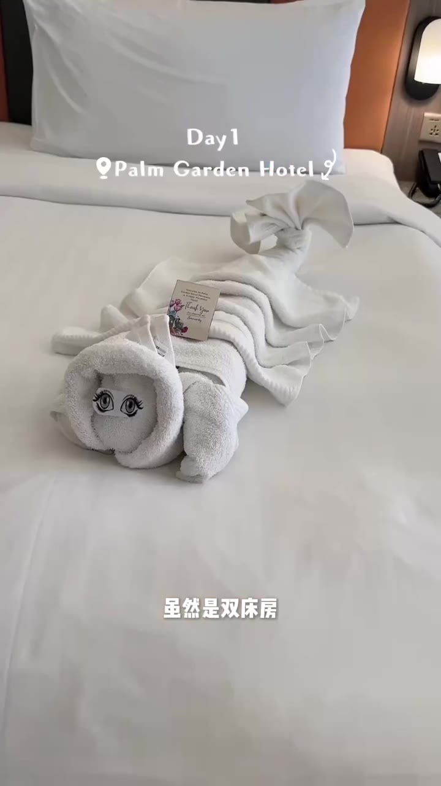
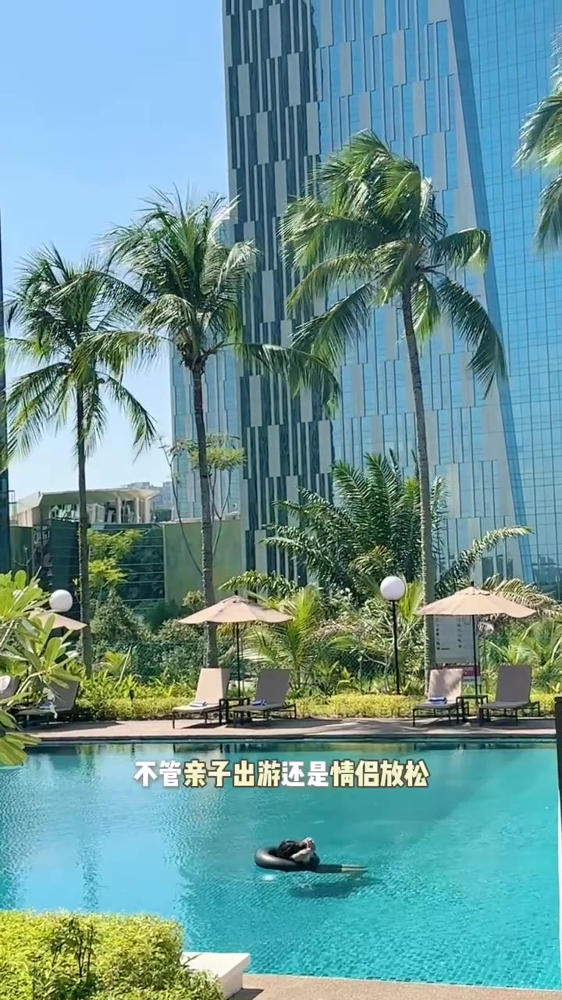
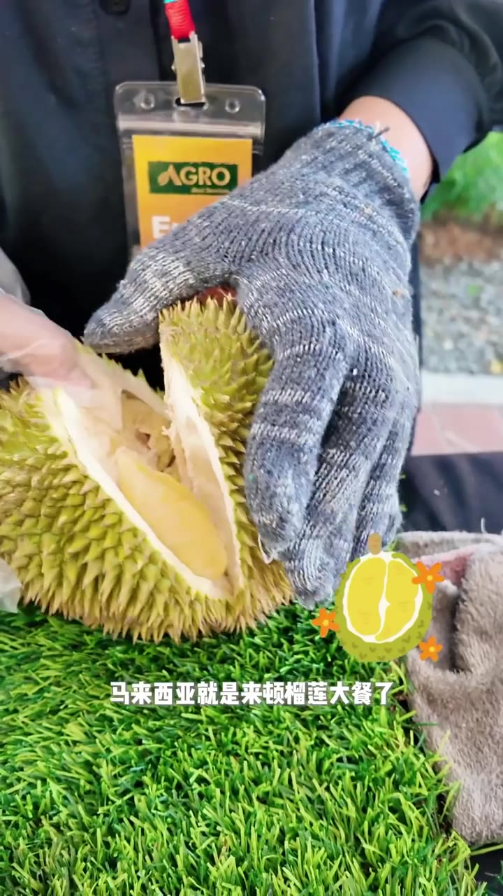
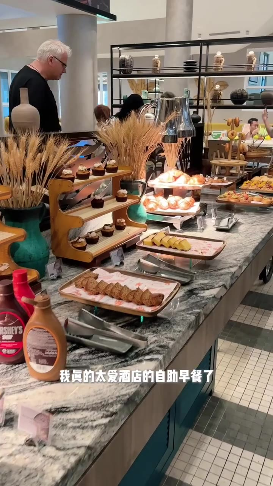
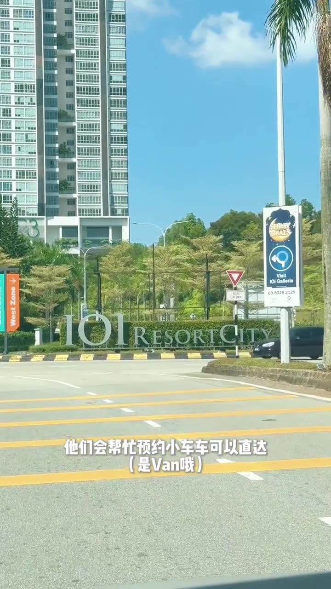

# RedNote Video Lens｜小红书视频透镜

[中文介绍](#中文介绍) · [English introduction](#english-introduction) · [安装](#安装--install)

由 [@Jingyuu1012](https://github.com/Jingyuu1012) 维护。

## 中文介绍

RedNote Video Lens 是一个适用于 Codex 与 Claude Code 的证据型 Agent Skill。你只要发送小红书完整分享链接、`xhslink.com` 短链接或关键词，它就会自动准备公开数据、平台字幕、视频证据副本、时间轴关键帧与剪辑节奏数据，不需要你手动下载或上传视频。

默认结果是一张逐段拆解表，包含：

| 时间 | 视频逐字稿 | 视频结构 | 钩子 / 留存机制 | 关键帧 | 画面描述 | 视频里的提示词 |
|---|---|---|---|---|---|---|

所有判断都基于实际获取并检查过的证据。无法读取的互动数据、听不清的字幕和未获取的评论主题会明确标注，不会猜测。

## English introduction

RedNote Video Lens is an evidence-first Agent Skill for Codex and Claude Code. Give it a Xiaohongshu/RedNote share URL, an `xhslink.com` short URL, or a keyword; it prepares public metadata, available platform subtitles, a local evidence copy of the video, inspected keyframes, and pacing signals without asking the user to upload the source video manually.

The default deliverable is the same seven-column timeline shown above. Reports distinguish observed evidence from inference and mark unavailable inputs instead of inventing them.

## 真实案例：IOI 奢华酒店套餐

下面不是占位符，而是使用 RedNote Video Lens 实际提取并检查的案例。

- 原视频：[🇲🇾IOI奢华酒店套餐｜十一黄金周度假攻略✨](https://www.xiaohongshu.com/discovery/item/68cd024d0000000007028131)
- 发布账号：I0I酒店集团
- 时长：80.07 秒
- 公开互动快照（2026-09-04 获取）：3,442 赞 · 266 收藏 · 11 评论 · 41 分享
- 剪辑节奏：检测到 57 次切换；中位镜头间隔 1.25 秒
- 说明：逐字稿以平台字幕为主，并结合画面文字校正；无法可靠确认的内容标为 `[听不清]`。

> 关键帧仅作为评论、研究及报告格式示例，版权归原视频权利人所有；本仓库不提供或再分发原视频。

| 时间 | 视频逐字稿 | 视频结构 | 钩子 / 留存机制 | 关键帧 | 画面描述 | 视频里的提示词 |
|---|---|---|---|---|---|---|
| 00:00–00:07 | “谁说度假一定要搭飞机？我也是才知道吉隆坡隔壁就有一个偷懒圣地……三天两夜吃好住好还能逛街。” | 开场钩子＋利益承诺 | 反常识提问、近距离惊喜、一次承诺住宿／餐饮／购物三种收益 |  | 人物正面出场，阳光与度假村环境立即建立轻松旅行氛围。 | “谁说度假一定要搭飞机？” |
| 00:07–00:15 | “第一天我住的是心仪的 Palm Garden 度假村。虽然是双床房，但每张床都超宽敞，阳台也很大。” | Day 1 入住＋房型证明 | 先报地点，再用床宽、阳台等具体细节兑现住宿价值 |  | 镜头对准整洁床铺与毛巾造型，用房间实景代替空泛形容。 | “Day1 · Palm Garden Hotel”“虽然是双床房” |
| 00:15–00:22 | “早上这么美的阳光就很疗愈了。这儿的设施有儿童游乐区、泳池和健身房，不管亲子出游还是情侣放松，都能玩得舒服。” | 设施展示＋受众扩展 | 设施清单提升信息密度，同时点名亲子与情侣两类人群 |  | 蓝色泳池、棕榈树和酒店建筑形成度假感，画面直接支撑“亲子／情侣放松”。 | “不管亲子出游还是情侣放松” |
| 00:22–00:28 | “国内宵夜是撸串儿，马来西亚就是来顿榴莲大餐了。搭配本地小吃，香得我头发都在冒烟儿，快乐值拉满。” | 本地特色插曲 | 中马宵夜对比＋榴莲近景制造味觉想象与新鲜感 |  | 手套开榴莲的动作特写是一种过程型证明，比单纯成品镜头更有停留感。 | “马来西亚就是来顿榴莲大餐了” |
| 00:28–00:41 | “晚上我们吃了度假村里的娘惹餐厅，不仅可以换上传统娘惹服拍照打卡，还有这个高级环境……菜品也很精致，[一道菜名听不清]还是第一次见。” | 文化体验＋餐饮升级 | 换装、打卡、环境、菜品连续加码，让餐厅段落不只是探店 |  | 人物走入带有娘惹装饰的体验区，地点标注和动作共同证明可打卡性。 | “Madam Lee 娘惹餐”“不仅可以换上传统娘惹服” |
| 00:41–00:50 | “四周城市灯光点点，美得像电影画面。一日之计在于晨，我真的太爱酒店的自助早餐了，而且这边更丰富一些。” | 夜景转场＋早餐证明 | 从夜景切到早餐形成时间推进；大量食物陈列强化“丰富” |  | 早餐台以多层陈列、甜点和面包构成丰盛感，镜头信息量高。 | “我真的太爱酒店的自助早餐了” |
| 00:50–01:00 | “吃过早饭我就换去附近的艾美酒店。这家更偏现代商务风，大床房间简约大气……行政走廊也是商务人士的必去之处，楼下就是商场。” | Day 2 换酒店＋定位差异 | 第二家酒店切换重启注意力，并用“现代商务风”与第一家形成对比 |  | 人物站在大床房中，白色空间与简洁软装强化现代商务定位。 | “Day2 · Le Meridien 艾美酒店”“这家更偏现代商务风” |
| 01:00–01:09 | “我们点了一桌经典菜，口味在线。下午赶上了酒店泳池的周末活动，好像只有周五和周六才有；来杯冰饮玩水，有种一秒穿越到海岛的错觉。” | 餐饮过渡＋周末活动高潮 | “仅周五和周六”带来稀缺信息；明亮活动布景形成强视觉变化 |  | 黄色主题打卡区、泳圈和礼袋让画面从客房的低饱和色切换到高饱和度。 | “赶上了酒店泳池的周末活动” |
| 01:09–01:16 | “最后一天睡到自然醒，顺路去了蒲种福朋喜来登酒店吃融合菜，午餐悠闲地收个尾。下午想要逛街的可以跟前台说一声。” | Day 3 收尾＋餐饮拼贴 | 四宫格一次展示多道菜，以高信息密度完成最后一天总结 |  | 四宫格同时展示面食、饮品、沙拉与汉堡，快速传递餐饮丰富度。 | “Day3 · Four Points by Sheraton Puchong”“吃融合菜午餐” |
| 01:16–01:20 | “他们会帮忙预约小车车，可以直达全马最大的 shopping mall，吃喝玩乐一站搞定。” | 便利性回收＋结尾 CTA | 用接驳车与商场作为具体收尾利益点，回应开场“还能逛街” |  | 行车视角拍到 IOI Resort City 标识，把抽象的交通便利落到真实地点。 | “预约小车车可以直达（是 Van 哦）” |

### 这条视频的可复用公式

```text
反常识提问 → 3天2夜总利益 → Day 1 度假与本地体验
→ Day 2 酒店风格切换与限定活动 → Day 3 餐饮收尾
→ 接驳车／商场便利性回收开场承诺
```

英文摘要：The real case above shows the expected output: a public performance snapshot, a complete timestamped transcript, structural roles, retention devices, inspected keyframes, grounded visual descriptions, and captured on-screen text.

## What is original here

This repository contains the RedNote Video Lens workflow, evidence schema, public-note metadata extraction, short-link normalization, pacing analysis, keyframe sampling, and safety/stopping rules. It does not bundle the source code or runtime files of its third-party dependencies.

See [THIRD_PARTY_NOTICES.md](THIRD_PARTY_NOTICES.md) for dependency attribution.

## Requirements

- macOS, Linux, or Windows
- Codex or Claude Code with personal skills support
- Python 3.9 or newer
- Dependencies in `requirements.txt` (`yt-dlp` and `imageio-ffmpeg`)
- Optional: [`redbook`](https://github.com/lucasygu/redbook) plus Node.js for keyword discovery, comments, and author-baseline analysis
- Optional: a compatible `xiaohongshu-downloader` skill for fallback transcription when platform subtitles are unavailable

The anonymous one-link workflow does not read browser cookies. If public access fails and a logged-in browser route is needed, the skill stops and requests permission first.

## 安装 / Install

### macOS / Linux — Codex

```bash
git clone https://github.com/Jingyuu1012/rednote-video-lens.git ~/.codex/skills/rednote-video-lens
cd ~/.codex/skills/rednote-video-lens
python3 -m venv .venv
.venv/bin/python -m pip install -r requirements.txt
.venv/bin/python scripts/rednote_video_lens.py doctor
```

### macOS / Linux — Claude Code

```bash
git clone https://github.com/Jingyuu1012/rednote-video-lens.git ~/.claude/skills/rednote-video-lens
cd ~/.claude/skills/rednote-video-lens
python3 -m venv .venv
.venv/bin/python -m pip install -r requirements.txt
.venv/bin/python scripts/rednote_video_lens.py doctor
```

If `python3` is unavailable on macOS, install Python first. Homebrew users can run `brew install python`. Node.js is only needed for the optional keyword/Redbook workflow.

### Windows — Codex

Clone the repository into your personal Codex skills directory:

```powershell
git clone https://github.com/Jingyuu1012/rednote-video-lens.git "$env:USERPROFILE\.codex\skills\rednote-video-lens"
Set-Location "$env:USERPROFILE\.codex\skills\rednote-video-lens"
py -3 -m venv .venv
.\.venv\Scripts\python.exe -m pip install -r requirements.txt
.\.venv\Scripts\python.exe scripts\rednote_video_lens.py doctor
```

Install the dependencies listed above, restart or refresh Codex, then run:

```text
Use $rednote-video-lens to analyze this video: <Xiaohongshu URL>
```

### Windows — Claude Code

Clone the same repository into Claude Code's personal skills directory:

```powershell
git clone https://github.com/Jingyuu1012/rednote-video-lens.git "$env:USERPROFILE\.claude\skills\rednote-video-lens"
Set-Location "$env:USERPROFILE\.claude\skills\rednote-video-lens"
py -3 -m venv .venv
.\.venv\Scripts\python.exe -m pip install -r requirements.txt
.\.venv\Scripts\python.exe scripts\rednote_video_lens.py doctor
```

Invoke it directly in Claude Code:

```text
/rednote-video-lens <Xiaohongshu URL>
```

Claude Code can also select it automatically from a natural-language request that matches the description. The `agents/openai.yaml` file supplies Codex UI metadata and is not required by Claude Code.

In either product, you can also ask naturally:

```text
Analyze this Xiaohongshu video: <URL>
```

## 跨平台命令 / Cross-platform commands

The examples below use `.venv/bin/python` on macOS/Linux. On Windows, replace it with `.venv\Scripts\python.exe`.

Verify the installation:

```bash
.venv/bin/python scripts/rednote_video_lens.py doctor
```

Prepare a complete evidence pack from a full or short share URL:

```bash
.venv/bin/python scripts/rednote_video_lens.py prepare \
  --url "<Xiaohongshu URL>" \
  --output-dir "./work/sample"
```

Extract frames from an existing local video:

```bash
.venv/bin/python scripts/rednote_video_lens.py extract "<video-path>" \
  --output-dir "./work/frames"
```

The `.ps1` commands remain available for existing Windows users:

```powershell
.\scripts\doctor.ps1
```

For a complete anonymous URL test:

```powershell
.\scripts\prepare_breakdown.ps1 -Url "<Xiaohongshu URL>" -OutputDirectory ".\work\sample"
```

## Safety and responsible use

- Read-only research: the skill must not like, collect, comment, follow, message, publish, or delete content.
- Stop on CAPTCHA, `NeedVerify`, protected empty responses, expired sessions, or IP blocks.
- Do not commit cookies, tokens, downloaded videos, subtitles, note metadata, or generated frames.
- Download and analyze only material you are entitled to access; do not use the workflow to redistribute source media.
- Respect Xiaohongshu's terms, creator rights, privacy, and applicable local law.

## License

RedNote Video Lens is released under the [MIT License](LICENSE). Third-party components retain their own licenses.
